<div align="center">

<picture>
  <source media="(prefers-color-scheme: dark)" srcset="./assets/dark.svg">
  <source media="(prefers-color-scheme: light)" srcset="./assets/light.svg">
  
</picture>

<br>

<p>
  <a href="https://rohith-portfolio-pied.vercel.app/"></a>
  <a href="https://www.linkedin.com/in/rohith-kumar-dhamagatla/"></a>
  <a href="https://kaggle.com/rohithd2006"></a>
  <a href="https://github.com/9059Rohith"></a>
  <a href="mailto:cb.sc.u4cse23018@cb.students.amrita.edu"></a>
</p>

<br>

### Building intelligent systems that move from ambitious ideas to useful products.

<sub>AI/ML ENGINEERING · FULL-STACK DEVELOPMENT · LLM & RAG SYSTEMS · SPEECH AI · OPEN SOURCE</sub>

</div>

---

## 👋 Hello, world

I'm **Rohith Kumar Dhamagatla**, a computer science student, AI engineer, and full-stack builder from Andhra Pradesh, India.

I enjoy the difficult middle ground between a promising prototype and a product people can trust. That means thinking about the model **and** the interface, retrieval quality **and** latency, system design **and** deployment. My work spans LLM applications, RAG pipelines, multi-agent systems, speech technology, healthcare AI, developer tooling, and full-stack products.

I care about building software with a clear reason to exist—especially technology that improves access, learning, safety, or decision-making.

<table>
  <tr>
    <td width="25%" align="center"><b>🎓 Education</b><br><sub>Amrita Vishwa Vidyapeetham<br>+ IIT Madras</sub></td>
    <td width="25%" align="center"><b>🧠 Core focus</b><br><sub>LLMs, RAG, agents<br>and speech AI</sub></td>
    <td width="25%" align="center"><b>🛠️ Builder mode</b><br><sub>Research prototype<br>to deployed product</sub></td>
    <td width="25%" align="center"><b>📍 Based in</b><br><sub>Anantapur<br>Andhra Pradesh, India</sub></td>
  </tr>
</table>

```python
class RohithKumar:
    role = ("AI/ML Engineer", "Full-Stack Developer", "Student Researcher")

    education = (
        "B.Tech CSE (AI/ML) — Amrita Vishwa Vidyapeetham",
        "B.S. Data Science & Applications — IIT Madras",
    )

    current_focus = {
        "intelligence": ["LLM systems", "RAG", "multi-agent workflows"],
        "interaction": ["speech AI", "accessible experiences"],
        "engineering": ["reliable backends", "real-time products", "deployment"],
    }

    mission = "Build useful systems, measure honestly, and keep improving."
```

## 🔭 Current workbench

<table>
  <tr>
    <td width="50%" valign="top">
      <h3>🤝 Saathi AI</h3>
      <p>Designing an AI learning companion around production-minded retrieval, clear grounding, and genuinely helpful tutoring experiences.</p>
      <p><code>RAG</code> <code>LLM orchestration</code> <code>Learning technology</code></p>
    </td>
    <td width="50%" valign="top">
      <h3>🗣️ ASD-Edge-ST</h3>
      <p>Exploring edge speech enhancement and assistive technology for children with autism, with attention to privacy and real-world constraints.</p>
      <p><code>Speech AI</code> <code>Edge ML</code> <code>Accessibility</code></p>
    </td>
  </tr>
  <tr>
    <td width="50%" valign="top">
      <h3>📄 Research & writing</h3>
      <p>Studying AI-assisted speech therapy and organizing the evidence, limitations, and open questions into rigorous technical writing.</p>
      <p><code>Literature review</code> <code>Experiment design</code> <code>IEEE</code></p>
    </td>
    <td width="50%" valign="top">
      <h3>🌍 Open building</h3>
      <p>Shipping hackathon experiments, contributing to open projects, and turning short feedback loops into better engineering judgment.</p>
      <p><code>Open source</code> <code>Hackathons</code> <code>Rapid prototyping</code></p>
    </td>
  </tr>
</table>

## 🚀 Featured projects

<table>
  <tr>
    <td width="50%" valign="top">
      <h3><a href="https://github.com/9059Rohith/immuno-graph">🧬 ImmunoGraph</a></h3>
      <p>A computational system that takes a pathogen protein and narrows the candidates that should be tested experimentally.</p>
      <p><b>Why it matters:</b> connects computational filtering with expensive real-world research decisions.</p>
      <p><code>AI</code> <code>Bioinformatics</code> <code>Research tooling</code></p>
    </td>
    <td width="50%" valign="top">
      <h3><a href="https://github.com/9059Rohith/Autonomous-AI-Powered-Multi-Agent-Warehouse-Fulfillment-System">🤖 Multi-Agent Warehouse</a></h3>
      <p>An Amazon-style fulfillment simulation with autonomous coordination, A*/CBS pathfinding, failure recovery, and a live digital twin.</p>
      <p><b>Engineering focus:</b> coordination under constraints, visibility, and graceful recovery.</p>
      <p><code>Python</code> <code>Multi-agent systems</code> <code>Streamlit</code></p>
    </td>
  </tr>
  <tr>
    <td width="50%" valign="top">
      <h3><a href="https://github.com/9059Rohith/sahayak">🩺 Sahayak</a></h3>
      <p>A voice-first multilingual health-triage assistant for pharmacy counters, with structured follow-ups and code-enforced safety rails.</p>
      <p><b>Product focus:</b> clear SAFE / CAUTION / SEE-A-DOCTOR guidance and printable summaries.</p>
      <p><code>Speech AI</code> <code>Safety</code> <code>Healthcare</code></p>
    </td>
    <td width="50%" valign="top">
      <h3><a href="https://github.com/9059Rohith/messageops">⚡ MessageOps</a></h3>
      <p>An AI meeting-execution system that transforms transcripts into owned, dated tasks with live tracking and automated follow-ups.</p>
      <p><b>Product focus:</b> closing the gap between conversation and accountable execution.</p>
      <p><code>LLM</code> <code>Automation</code> <code>Real-time UX</code></p>
    </td>
  </tr>
  <tr>
    <td width="50%" valign="top">
      <h3><a href="https://github.com/9059Rohith/prowider">🔀 Prowider</a></h3>
      <p>A production-grade lead-distribution platform with fair round-robin allocation, SSE updates, concurrency-safe transactions, and webhook idempotency.</p>
      <p><b>Engineering focus:</b> correctness under concurrency and reliable event processing.</p>
      <p><code>Next.js</code> <code>Prisma</code> <code>PostgreSQL</code></p>
    </td>
    <td width="50%" valign="top">
      <h3><a href="https://github.com/9059Rohith/incident_commander">🚨 Incident Commander</a></h3>
      <p>A reinforcement-learning environment where an LLM agent acts as an on-call SRE and stabilizes an AI platform through realistic incidents.</p>
      <p><b>Research focus:</b> agent decisions, operational trade-offs, and measurable recovery.</p>
      <p><code>Reinforcement learning</code> <code>LLM agents</code> <code>SRE</code></p>
    </td>
  </tr>
</table>

### More things I've built

- 🌌 **[StellarStep](https://github.com/9059Rohith/stellarstep)** — a neuro-inclusive MERN application that uses a space-themed experience to support routines and sensory regulation for children with autism.
- 🧑‍💼 **[Resume Skill Matcher](https://github.com/9059Rohith/Resume_skill_matcher)** — NLP-based resume analysis, role matching, and actionable skill-gap discovery.
- 🔐 **[ComputerSecurity](https://github.com/9059Rohith/ComputerSecurity)** — secure file management with MFA, AES/RSA hybrid cryptography, role-based access, signatures, and expiring storage.
- 🌪️ **[Disaster Guard](https://github.com/9059Rohith/Disaster_Mangement)** — full-stack disaster monitoring with weather data, citizen reports, and a centralized response dashboard.
- 💬 **[TARS](https://github.com/9059Rohith/tars)** — real-time chat with DMs, groups, presence, typing indicators, unread counts, and reactions.
- 💊 **[Prescripto](https://github.com/9059Rohith/Prescripto)** — appointment scheduling and digital prescriptions for streamlined patient–doctor workflows.

<div align="center">

[**Explore all repositories →**](https://github.com/9059Rohith?tab=repositories)

</div>

## ⚙️ Technology universe

I choose tools based on the problem, not the trend. These are the technologies I most often reach for:

### Languages


### AI, ML & intelligent systems


### Product engineering


### Data, cloud & delivery


<details>
<summary><b>Open the extended toolkit</b></summary>
<br>

| Area | Tools and concepts |
|---|---|
| **LLM engineering** | Prompt design, retrieval pipelines, grounding, vector search, ChromaDB, FAISS, Groq, model APIs |
| **Backend systems** | REST APIs, SSE, authentication, queues, webhooks, concurrency, idempotency, caching |
| **Data & ML** | Data preparation, classical ML, deep learning, evaluation, experiment tracking, inference |
| **Frontend** | Responsive UI, component systems, accessibility, state management, real-time experiences |
| **Engineering** | System design, testing, observability, containerization, CI/CD, cloud deployment |

</details>

## 🧭 How I build

```text
01  Start with the user and the constraint—not the model.
02  Design the smallest system that can prove the idea.
03  Make failure visible, recoverable, and measurable.
04  Treat safety, latency, and usability as product features.
05  Ship early enough to learn; iterate carefully enough to improve.
```

| Principle | What it means in practice |
|---|---|
| **Useful beats flashy** | A smaller dependable workflow is better than an impressive demo nobody can trust. |
| **Evidence beats intuition** | Define what success means, instrument it, and let results change the design. |
| **Systems beat isolated models** | Great AI products need retrieval, guardrails, interfaces, evaluation, and operations. |
| **Clarity beats cleverness** | Code, architecture, and documentation should make the next decision easier. |

## 🏆 Highlights beyond the commit graph

- 🥇 Reached the **CodeVita finalist** stage, placing in the top tier of participants.
- 🌐 Served as a **Google Student Ambassador**.
- 🏊 Represented **Andhra Pradesh** in state-level competitive swimming.
- 🏅 Earned placements in **FIN HACK101** and **Suprathon 2025**.
- 🚀 Built and shipped a growing collection of hackathon projects across legal tech, compliance, incident response, healthcare, learning, and accessibility.
- 🔬 Balancing product engineering with research interests in speech technology and responsible applied AI.

## 📊 GitHub activity

<div align="center">

<picture>
  <source media="(prefers-color-scheme: dark)" srcset="https://github-profile-summary-cards.vercel.app/api/cards/profile-details?username=9059Rohith&theme=github_dark">
  <source media="(prefers-color-scheme: light)" srcset="https://github-profile-summary-cards.vercel.app/api/cards/profile-details?username=9059Rohith&theme=default">
  
</picture>

<br>


</div>

> The graph tells you how often I build. The repositories tell you what I care about.

## 🤝 Let's create something useful

I'm always interested in thoughtful conversations and collaborations around:

- applied AI and machine-learning products;
- LLM/RAG architecture and evaluation;
- speech AI, accessibility, and assistive technology;
- multi-agent simulations and intelligent automation;
- full-stack systems with interesting reliability challenges;
- open-source work, research, and hackathons.

<div align="center">

### If the problem is meaningful and technically difficult, I want to hear about it.

[](mailto:cb.sc.u4cse23018@cb.students.amrita.edu)

[Portfolio](https://rohith-portfolio-pied.vercel.app/) ·
[LinkedIn](https://www.linkedin.com/in/rohith-kumar-dhamagatla/) ·
[Kaggle](https://kaggle.com/rohithd2006) ·
[All repositories](https://github.com/9059Rohith?tab=repositories)

<br>

<sub>Code with purpose · Debug with patience · Deploy with confidence</sub>

</div>
